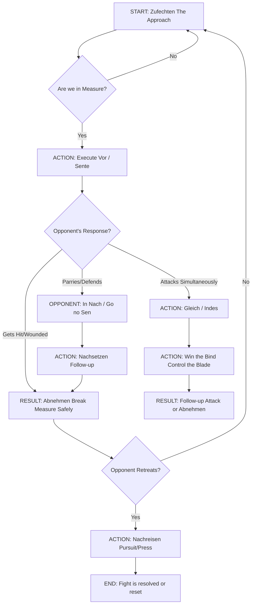
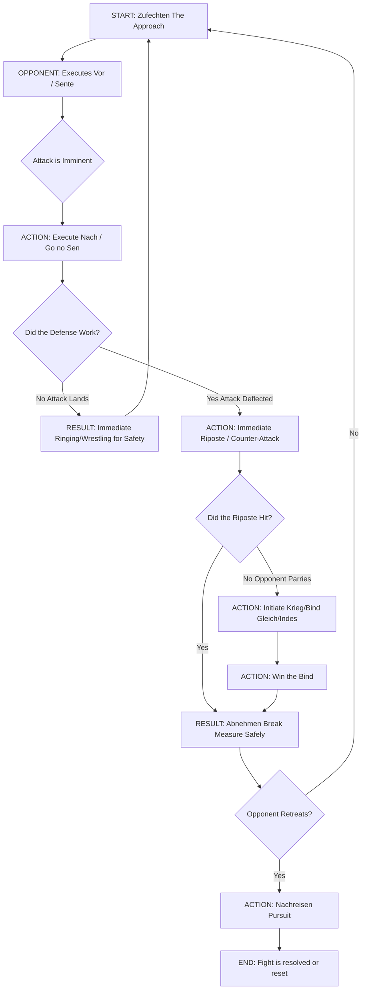

Phase,Description,Strategic Goal (Timing)

1. **Vor (Before)**,You initiate the action before your opponent. This is the pre-emptive strike (Sente).,Seize the Initiative. Hit first and decisively.
2. **Nach (After)**,"You react and hit after your opponent has initiated their attack, often as a parry-riposte.","Effective Defense. Accept the attack, neutralize it, and counter-hit (Go no Sen)."
3. **Gleich (During/Simultaneously)**,"You attack at the exact same time as your opponent, often resulting in a bind or simultaneous hit.",Control the Bind. Win the blade engagement (the Krieg / Tsubazeri).
4. **Indes (In the Moment)**,"The ""middle time"" – the fleeting moment when your opponent is committed to an action but hasn't completed it, or while they are recovering.",Exploit the Opening. Exploit an attack that is already committed or find an opening during an opponent's transition. This is the highest skill level of timing.

### The Japanese concept of Sente (Initiative)

🇯🇵 Sente (先手): The Initiative
The term Sente fundamentally means "taking the initiative" or "acting first." In Kenjutsu, Iaido, and other Budo, the goal is always to control the flow of the fight and impose your will upon the opponent.

There are three key levels of initiative, often referred to as the Mitsu no Sen (三つの先 - The Three Initiations):

1. Sen no Sen (先の先) - Initiative Before Initiative
   Meaning: To seize the initiative the instant your opponent's intention to attack is perceived, but before their physical action has begun.

The Action: You attack while your opponent is still in the preparation or planning phase (the "mental wind-up"). You interrupt their plan before it leaves the runway.

Timing: The highest level of timing. It relies on reading the opponent's spirit (Ki) and minute physical tells (shifting balance, change in breath, muscle tension, or the slight raising of the sword).

Analogy to HEMA: This is the most refined and ideal version of the Vor.

2. Sente (先手) or Sen (先) - Simple Initiative
   Meaning: To attack first, preemptively, or to force your opponent into a defensive posture.

The Action: A committed, decisive, and threatening attack that forces your opponent to address your weapon immediately, preventing them from carrying out their own attack.

Timing: A clear Vor phase action. You are attacking sooner than they attack you.

Analogy to HEMA: This is the practical definition of the Vor in the Liechtenauer tradition: "The Vor is that you shall always come before with a strike or stab to his opening, sooner than he comes to you, so he must parry you."

---

Counter starts here (Nach)

3. Go no Sen (後の先) - Initiative After
   Meaning: Literally "Initiative after the fact," or Counter-Initiative. This is the art of intentionally yielding the initial attack to the opponent, only to neutralize it and counter-attack immediately.

The Action: The opponent commits to their attack, and you respond with a robust defense (a parry, block, or evasion), ensuring their attack fails or is deflected, followed by an immediate, decisive counter-strike (the riposte). You use their forward commitment against them.

Timing: You wait until the opponent's attack is fully committed and in motion, then you intercept or deflect it at the point of greatest danger (the moment it is about to land).

Analogy to HEMA: This is the primary action of the Nach (After) phase. You allow them to execute the Vor against you, and you successfully execute the Nach against them.

Japanese Timing,HEMA Phase,Strategy (The Goal),Key HEMA Techniques/Concepts
Sen no Sen (先の先),Ideal Vor,Interrupt and Preempt: Attack before your opponent's intent can manifest into action. The most refined form of seizing initiative.,"Abzug (draw out), reading the Fehler (fault/mistake), Fühlen (feeling the change in the bind)."
Sente / Sen (先手 / 先),Practical Vor,"Assert the Attack: Strike first with a decisive, committed action that forces the opponent to immediately defend.","Vorschlag (fore-strike), Oberhau (high cut), Uberlauffen (running over the opponent's low guard)."
Tai no Sen (体の先),Gleich / Indes,Simultaneous Exploitation: Strike during the exchange or capitalize on the moment of transition/vulnerability created by their commitment. Often involves evasion.,"Abschneiden (cutting off the limbs), Zucken (snatching/pulling out of the bind), Duplieren (doubling the attack)."
Go no Sen (後の先),Nach,"Counter-Initiative: Wait for their attack, neutralize it defensively, and execute a high-certainty, unblockable riposte.","Absetzen (setting aside/parrying-thrusting), Versetzen (parry), Nachschlag (after-strike/riposte)."

4. Tai no Sen (体の先 or 対の先) - Simultaneous Initiative
   Meaning: Literally, "Initiative of the Body" or "Initiative of Facing." This refers to taking the initiative at the moment of contact, or immediately preceding it, often by exploiting the opponent's commitment or lack of balance/guard.

The Action: You wait for the opponent to move (or provoke them into moving), and as they commit their energy and balance toward you, you execute your technique simultaneously with, or directly into, their attack. This is not a parry-then-riposte; it's an interception, displacement, or entry that uses the opponent's momentum.

Timing: This timing is executed when both parties are in motion. You intercept the attacker's path, cut an exposed limb while they are swinging, or change the target in the split-second their focus is committed.

Analogy to HEMA: This concept most closely aligns with the skilled execution of Indes (Instantly / Meanwhile). It requires using the five words (Vor, Nach, Indes, Strong, Weak) to win the split-second engagement.

The Indes in Tai no Sen: When two swords meet (Gleich / Krieg), you immediately use the Weak part of your blade against the Strong part of theirs to quickly disengage, wind, or cut an exposed opening in the moment the swords are bound, thus seizing control.

Tai no Sen is the martial artist's highest aspiration because it maximizes efficiency: it simultaneously defeats the opponent's action while delivering your own.

## Flowcharts

### ⚔️ Flowchart: Scenario 1 - Seizing the Initiative Sente/Vor

This chart shows the path when you successfully establish the Vor and dictate the fight.

### 🛡️ Flowchart: Scenario 2 - Reacting to the Attack Go no Sen/Nach

This chart shows the path when you successfully respond to your opponent's initiative and counter-attack.

# 🇯🇵 The Stages of Japanese Sword Combat

Japanese sword fighting is often conceptualized in terms of Ma-ai (間合い - Distance), which dictates the strategic stage of the encounter.

1. Tō-ma (遠間 - Long Distance) - The Approach
   Description: The distance where neither sword can reach the opponent without taking multiple steps. This is the Zufechten equivalent.

Goal: To establish control (Seme), observe the opponent's posture (Kamae), and mentally prepare for the entry.

Options:

Seme (攻め): Apply mental pressure by focusing Ki (spirit/intent) or making small, threatening advances.

Kamae (構え): Maintain a strong, balanced posture (like Chūdan-no-Kamae or Jōdan-no-Kamae), showing no openings.

Shifting Ma-ai: Move forward gradually, controlling the space until you reach a striking distance.

2. Issoku Ittō no Ma (一足一刀の間) - One-Step, One-Cut Distance
   Description: The ideal, critical distance where a single, committed step (often an advancing step or fumi-komi) and a single cut (Kiri) can reach the opponent. This is the Zueinander equivalent.

Goal: To strike the decisive blow first by seizing Sente.

Options:

Execute Sente: Initiate the attack from this distance before the opponent.

Apply Seme: Use feints or small movements to draw a reaction and expose an opening (Suki).

Observe and Wait: Be ready to counter (Go no Sen) if the opponent acts first.

3. Chika-ma (近間 - Close Distance) - In-Fighting
   Description: Very close range, often after a failed cut, a parry, or a collision (Tsubazeri). The swords are likely bound or crossed.

Goal: To finish the fight or break free safely.

Options:

Tsubazeri-ai (鍔迫り合い): Pressing sword guards together. The goal is to control the opponent's balance and transition to a close-quarters technique.

Ura-waza (裏技): Close-quarters techniques like grappling (Kumi-uchi), strikes with the hilt, or short, close-range thrusts.

Disengagem
